# RDS, Aurora and Elasticache

---

## Content

- [RDS, Aurora and Elasticache](#rds-aurora-and-elasticache)
  - [Content](#content)
    - [Introduction](#introduction)
    - [List of important ports you should know](#list-of-important-ports-you-should-know)
  - [Practice](#practice)
    - [How to create an RDS SQL Database](#how-to-create-an-rds-sql-database)
    - [How to create an ElastiCache Redis Database](#how-to-create-an-elasticache-redis-database)

---

### Introduction

### List of important ports you should know

Importan ports:

- FTP:    `21`
- SSH:    `22`
- SFTP:   `22`
- HTTP:   `80`
- HTTPS:  `443`

RDS DB Points:

- PostgreSQL: `5432`
- MySQL: `3306`
- Oracle RDS: `1521`
- MSSQL Server: `1433`
- MariaDB: `3306`
- Aurora (PostgreSQL): `5432`
- Aurora (MySQL): `3306`

---

## Practice

### How to create an RDS SQL Database

1. Navigate to the AWS Console
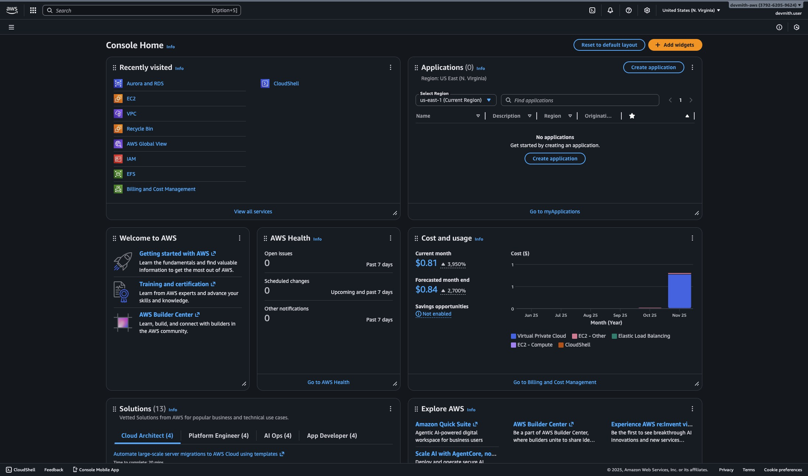

2. Search for RDS at the search bar
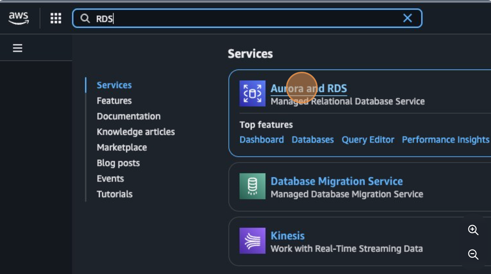

3. Click on "Create a database"
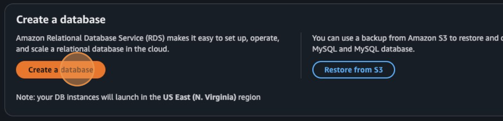
4. Select our desired DB
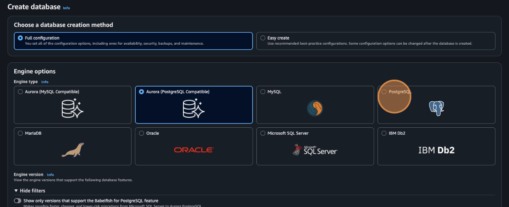
5. Select the DB template
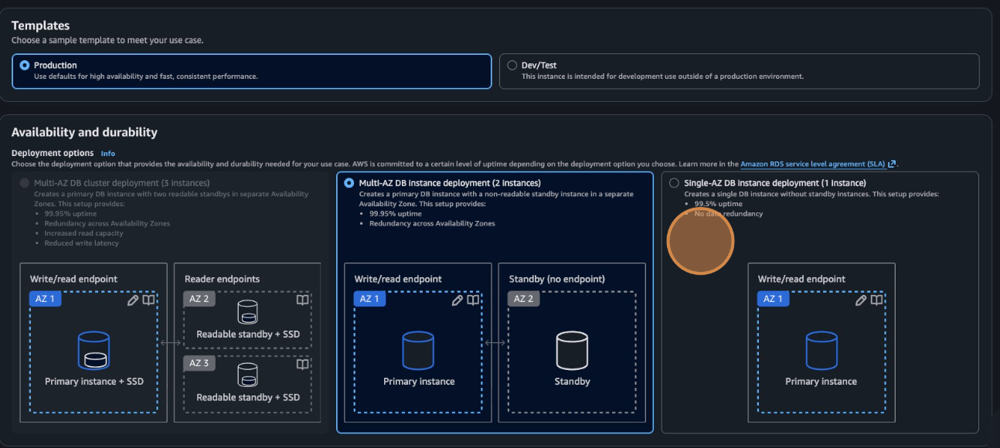
6. Type the name of your DB
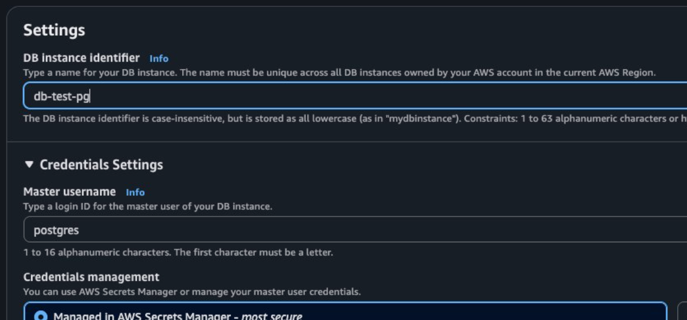
7. Select "Self managed" as our "Credentials management" and type a secure password
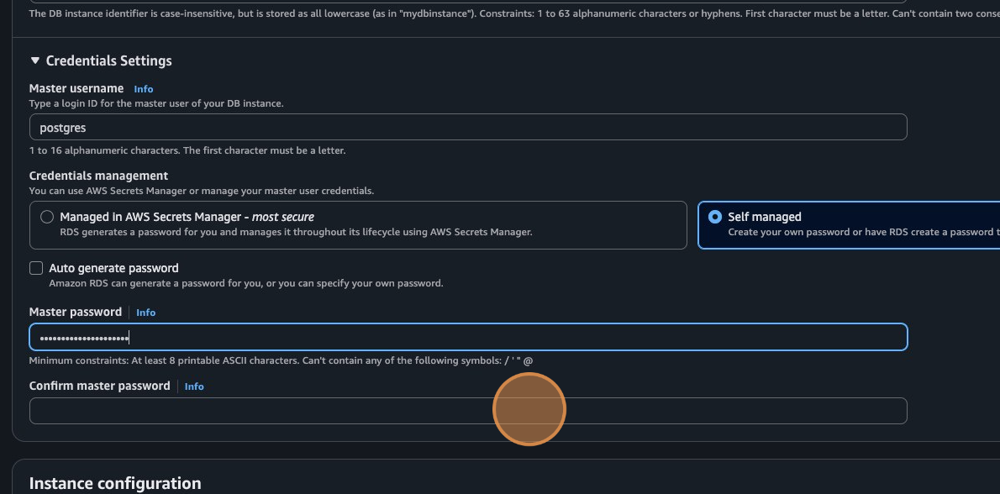
8. Select instance configuration as the most basic one (free tier)
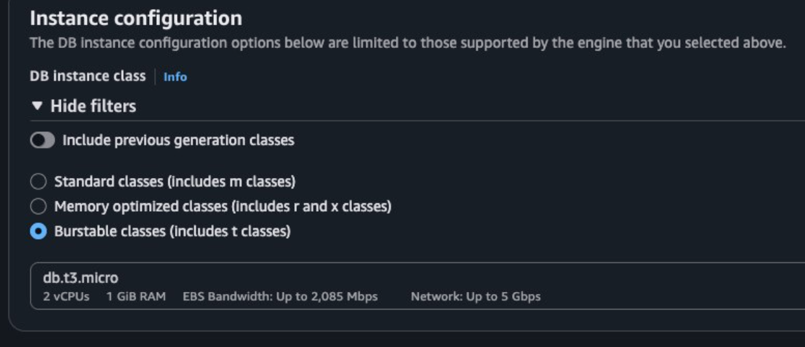
9. For storage select the basic one, and set 20 GiB as a storage volume (20 is the minumum)
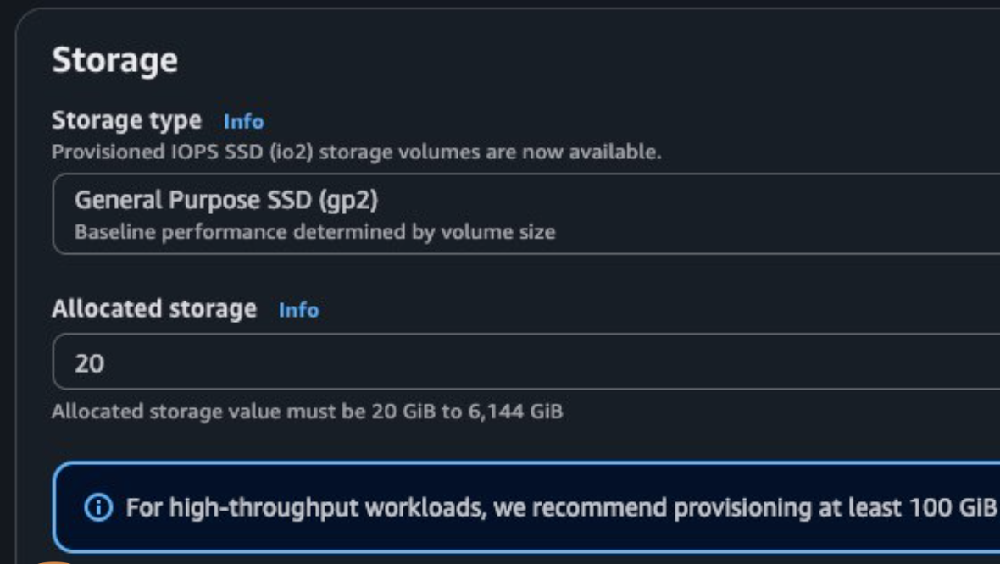
10. Adjusting connectivity
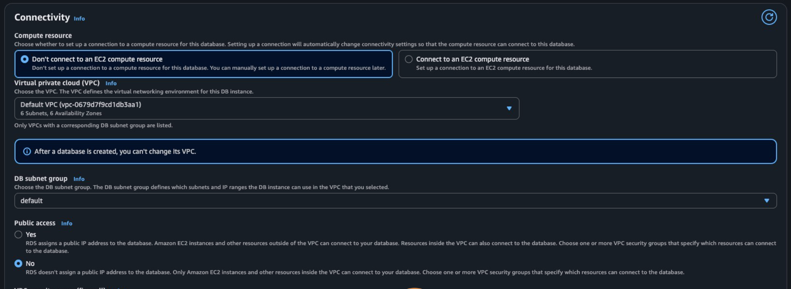
11. Creating new security group
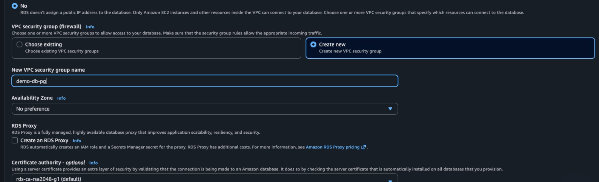
And remember your port number
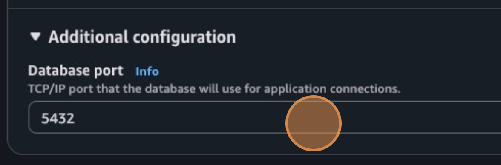
12. Set DB Auth as is (we already created a password for this)
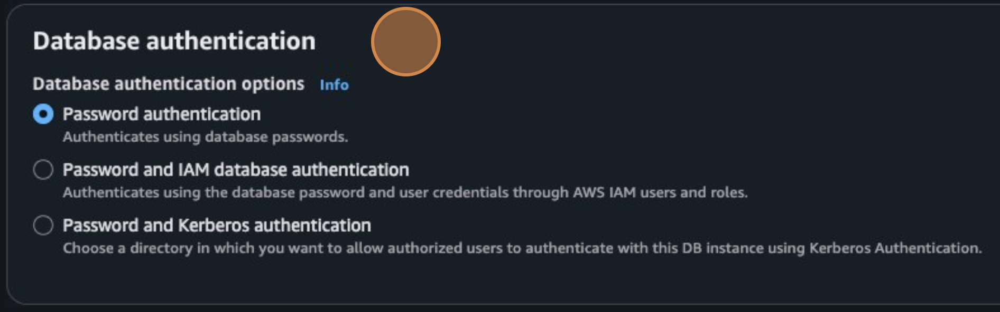
13. Set the initial DB name and enable the automated backup
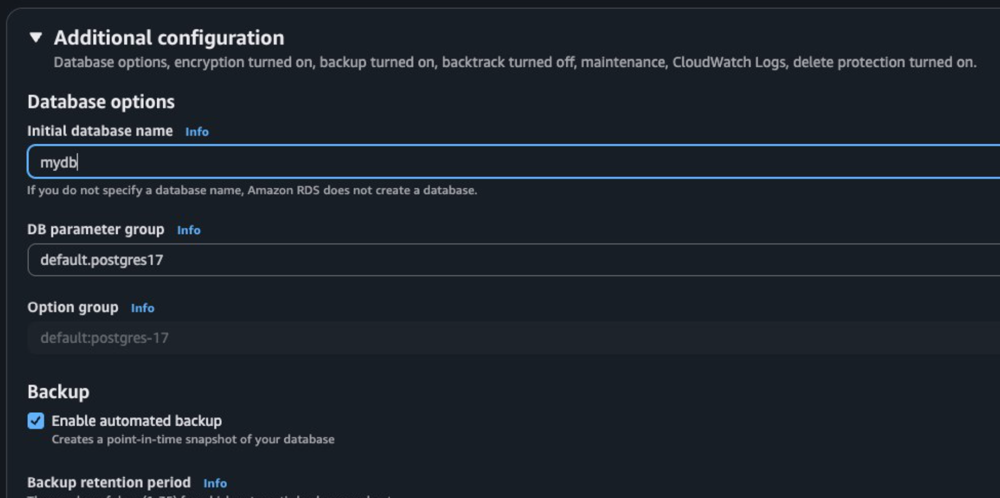
14. Configure monitoring (we are unchecking it)
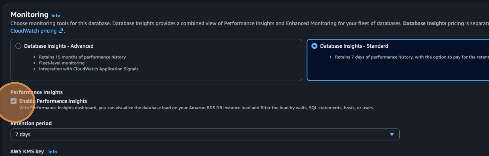
15. And we are done
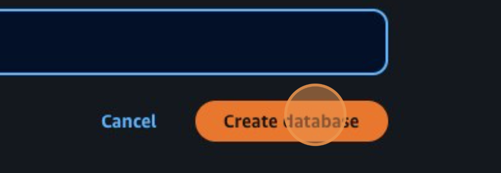

### How to create an ElastiCache Redis Database

![WARNING]
RDS Storage Auto Scale