# AWS Route 53

---

## Content

- [AWS Route 53](#aws-route-53)
  - [Content](#content)
  - [AWS Route 53 - DNS Service](#aws-route-53---dns-service)
  - [Introduction](#introduction)
    - [DNS Terminology](#dns-terminology)
    - [FQDN (Fully Qualified Domain Name)](#fqdn-fully-qualified-domain-name)
    - [How DNS works?](#how-dns-works)
  - [What is Route 53?](#what-is-route-53)
  - [Hosted Zones](#hosted-zones)
  - [DNS Record Structure](#dns-record-structure)
  - [DNS Record Types](#dns-record-types)
    - [Basic Record Types](#basic-record-types)
    - [AWS-Specific Record Type](#aws-specific-record-type)
    - [Additional Record Types](#additional-record-types)
  - [TTL (Time To Live)](#ttl-time-to-live)
  - [Practice](#practice)
    - [How to register a domain](#how-to-register-a-domain)

---

## AWS Route 53 - DNS Service

## Introduction

### DNS Terminology

- Domain register
- DNS Registers
- Zone File
- Nameserver
- Top-Level Domain (TLD)
- Second-Level Domain (SLD)

### FQDN (Fully Qualified Domain Name)

```markdown
http://api.www.example.com.
└─┬─┘  └┬┘└┬─┘└──┬──┘└┬┘└┬┘
  │     │  │     │    │  └─── Root
  │     │  │     │    └────── TLD (Top-Level Domain)
  │     │  │     └─────────── SLD (Second-Level Domain)
  │     │  └───────────────── Subdomain
  │     └──────────────────── Domain Name
  └────────────────────────── Protocol
```

**Components:**

- **Protocol**: `http://` or `https://`
- **Domain Name**: `api.www.example.com.`
- **Subdomain**: `api.www`
- **SLD**: `example`
- **TLD**: `com`
- **Root**: `.` (implicit)


### How DNS works?

```mermaid
flowchart TD
    Browser["🖥️ Web Browser<br/>You want to access<br/>example.com"]
    LocalDNS["📋 Local DNS Server<br/>Assigned and managed by your<br/>company or dynamically assigned<br/>by your ISP"]
    RootDNS["🌐 Root DNS Server<br/>Managed by ICANN"]
    TLDDNS["🗄️ TLD DNS Server<br/>(.com)<br/>Managed by IANA<br/>(Branch of ICANN)"]
    SLDDNS["🗄️ SLD DNS Server<br/>(example.com)<br/>Managed by domain registrar<br/>(e.g., Amazon<br/>Register, Inc.)"]
    WebServer["🌐 Web Server<br/>(example.com)<br/>(IP: 9.10.11.12)"]
    
    Browser -->|"1. example.com?"| LocalDNS
    LocalDNS -->|"2. example.com?"| RootDNS
    RootDNS -->|"3. .com NS 1.2.3.4"| LocalDNS
    LocalDNS -->|"4. example.com?"| TLDDNS
    TLDDNS -->|"5. example.com NS 5.6.7.8"| LocalDNS
    LocalDNS -->|"6. example.com?"| SLDDNS
    SLDDNS -->|"7. example.com IP 9.10.11.12"| LocalDNS
    LocalDNS -->|"8. 9.10.11.12"| Browser
    Browser -->|"9. HTTP/HTTPS Connection"| WebServer
    
    style Browser fill:#e3f2fd
    style LocalDNS fill:#fff3e0
    style RootDNS fill:#e8f5e9
    style TLDDNS fill:#e8f5e9
    style SLDDNS fill:#e8f5e9
    style WebServer fill:#fce4ec
    
    subgraph Cache["💾 CACHE TTL"]
        LocalDNS
    end
```



## What is Route 53?

Route 53 is AWS's managed DNS (Domain Name System) service. The name comes from DNS traditionally operating on port 53. It translates human-readable domain names like "myapp.com" into IP addresses like "192.168.1.1" that computers can understand.

**Key differentiators from traditional DNS:**

- 100% availability SLA (only AWS service with this guarantee)
- Globally distributed using AWS edge locations
- Intelligent routing capabilities beyond standard DNS
- Fully managed, scalable, and authoritative
  - Authoritative = you (the customer) can update DNS records
- **Also functions as a Domain Registrar** - you can purchase and register domains directly through Route 53

## Hosted Zones

A hosted zone is a container that holds DNS records for a specific domain. Think of it as a database containing all translation rules for your domain and its subdomains.

**Types:**

- **Public Hosted Zones**: For domains accessible from the public internet
  - Contains records that specify how to route traffic on the internet
  - Example: `application1.mypublicdomain.com`
  - Cost: $0.50/month per zone
  
- **Private Hosted Zones**: For internal use within AWS VPCs
  - Contains records that specify how to route traffic within VPC(s)
  - Only accessible from associated VPCs
  - Example: `application1.company.internal`
  - Cost: $0.50/month per zone

When you create a hosted zone, Route 53 automatically assigns four name servers for redundancy. You must configure these name servers in your domain registrar for Route 53 to become authoritative for your domain.

## DNS Record Structure

Each DNS record contains the following components:

- **Domain/Subdomain Name**: e.g., example.com
- **Record Type**: e.g., A, AAAA, CNAME
- **Value**: The answer to the DNS query (e.g., IP address)
- **Routing Policy**: How Route 53 responds to queries
- **TTL**: Amount of time the record is cached at DNS resolvers

## DNS Record Types

### Basic Record Types

**A Record**: Maps domain name to IPv4 address

- Example: `myapp.com` → `54.123.45.67`

**AAAA Record**: Maps domain name to IPv6 address

- Same as A record but for IPv6 format

**CNAME Record**: Creates alias for domain names (hostname to hostname)

- Maps one hostname to another hostname
- Target must have an A or AAAA record
- Example: `www.myapp.com` → `myapp.com`
- **Critical Limitation**: Cannot be used at domain apex (Zone Apex/root domain)
  - ❌ Cannot create CNAME for `example.com`
  - ✅ Can create CNAME for `www.example.com`

**NS Record**: Specifies authoritative name servers for the Hosted Zone

- Controls how traffic is routed for a domain

### AWS-Specific Record Type

**Alias Record**: AWS proprietary extension

- Maps hostname to AWS resource
- Works at domain apex (solves CNAME limitation)
- Can point to AWS resources:
  - Elastic Load Balancers (ALB, NLB, CLB)
  - CloudFront Distributions
  - API Gateway
  - Elastic Beanstalk environments
  - S3 Websites
  - VPC Interface Endpoints
  - Global Accelerator
  - Route 53 record in the same hosted zone
- **No charge for DNS queries to Alias records**
- Native health check capability

### Additional Record Types

**MX Record**: Specifies mail servers for domain

**TXT Record**: Holds arbitrary text, commonly used for:

- Domain verification
- Email security policies (SPF, DKIM)

**SOA Record**: Contains administrative information about the zone

**Advanced Record Types** (for certification):

- **CAA**: Specifies which Certificate Authorities can issue SSL/TLS certificates for your domain
- **DS**: Used in DNSSEC for chain of trust
- **NAPTR**: Used for telephone services and URI applications
- **PTR**: Reverse DNS lookup (IP to domain name)
- **SPF**: Email spoofing prevention (actually implemented as TXT record)
- **SRV**: Specifies location of specific services

**Route 53 Supported Record Types:**

- Mandatory: A / AAAA / CNAME / NS
- Advanced: CAA / DS / MX / NAPTR / PTR / SOA / TXT / SPF / SRV

## TTL (Time To Live)

TTL specifies how long (in seconds) DNS resolvers and clients should cache your DNS response before querying Route 53 again.

**How TTL Works:**

1. Client queries Route 53 for domain
2. Route 53 responds with IP and TTL value
3. Client caches result for TTL duration
4. After TTL expires, client queries Route 53 again

**High TTL (e.g., 86400 seconds = 24 hours)**

- Less traffic on Route 53 (lower cost)
- Records potentially outdated for longer
- Use when records rarely change

**Low TTL (e.g., 60 seconds)**

- More traffic on Route 53 (higher cost)
- Records are less likely to be outdated
- Easy to change records (faster propagation)
- Use before planned changes, then increase after

**Important**: Except for Alias records, TTL is mandatory for every DNS record type.

---

## Practice

### How to register a domain


---

[< Back to index](../)