# AWS Route 53

---

## Content

- [AWS Route 53](#aws-route-53)
  - [Content](#content)
- [AWS Route 53 - DNS Service](#aws-route-53---dns-service)
  - [Introduction](#introduction)
    - [DNS Terminology](#dns-terminology)
    - [FQDN (Fully Qualified Domain Name)](#fqdn-fully-qualified-domain-name)
    - [How DNS works?](#how-dns-works)
  - [What is Route 53?](#what-is-route-53)
  - [Hosted Zones](#hosted-zones)
  - [DNS Record Structure](#dns-record-structure)
  - [DNS Record Types](#dns-record-types)
    - [Basic Record Types](#basic-record-types)
    - [AWS-Specific Record Type](#aws-specific-record-type)
    - [Additional Record Types](#additional-record-types)
  - [TTL (Time To Live)](#ttl-time-to-live)
  - [Routing Policies](#routing-policies)
    - [Simple Routing](#simple-routing)
    - [Weighted Routing](#weighted-routing)
    - [Latency-Based Routing](#latency-based-routing)
    - [Geolocation Routing](#geolocation-routing)
    - [Geoproximity Routing](#geoproximity-routing)
    - [Failover Routing (Active-Passive)](#failover-routing-active-passive)
    - [Multivalue Answer Routing](#multivalue-answer-routing)
  - [Health Checks](#health-checks)
    - [Types of Health Checks:](#types-of-health-checks)
    - [Health Check Features:](#health-check-features)
    - [Health Check Behavior:](#health-check-behavior)
  - [Combining Routing Policies with Health Checks](#combining-routing-policies-with-health-checks)
  - [Cost Considerations](#cost-considerations)
  - [AWS Service Integration](#aws-service-integration)
  - [Common Use Cases for Certification](#common-use-cases-for-certification)
  - [Important Limitations](#important-limitations)
  - [Real-World Scenario: Global Application with Failover](#real-world-scenario-global-application-with-failover)
- [Practice](#practice)
    - [How to register a domain](#how-to-register-a-domain)

---

# AWS Route 53 - DNS Service

## Introduction

### DNS Terminology

- Domain register
- DNS Registers
- Zone File
- Nameserver
- Top-Level Domain (TLD)
- Second-Level Domain (SLD)

### FQDN (Fully Qualified Domain Name)

```markdown
http://api.www.example.com.
└─┬─┘  └┬┘└┬─┘└──┬──┘└┬┘└┬┘
  │     │  │     │    │  └─── Root
  │     │  │     │    └────── TLD (Top-Level Domain)
  │     │  │     └─────────── SLD (Second-Level Domain)
  │     │  └───────────────── Subdomain
  │     └──────────────────── Domain Name
  └────────────────────────── Protocol
```

**Components:**

- **Protocol**: `http://` or `https://`
- **Domain Name**: `api.www.example.com.`
- **Subdomain**: `api.www`
- **SLD**: `example`
- **TLD**: `com`
- **Root**: `.` (implicit)


### How DNS works?

```mermaid
flowchart TD
    Browser["🖥️ Web Browser<br/>You want to access<br/>example.com"]
    LocalDNS["📋 Local DNS Server<br/>Assigned and managed by your<br/>company or dynamically assigned<br/>by your ISP"]
    RootDNS["🌐 Root DNS Server<br/>Managed by ICANN"]
    TLDDNS["🗄️ TLD DNS Server<br/>(.com)<br/>Managed by IANA<br/>(Branch of ICANN)"]
    SLDDNS["🗄️ SLD DNS Server<br/>(example.com)<br/>Managed by domain registrar<br/>(e.g., Amazon<br/>Register, Inc.)"]
    WebServer["🌐 Web Server<br/>(example.com)<br/>(IP: 9.10.11.12)"]
    
    Browser -->|"1. example.com?"| LocalDNS
    LocalDNS -->|"2. example.com?"| RootDNS
    RootDNS -->|"3. .com NS 1.2.3.4"| LocalDNS
    LocalDNS -->|"4. example.com?"| TLDDNS
    TLDDNS -->|"5. example.com NS 5.6.7.8"| LocalDNS
    LocalDNS -->|"6. example.com?"| SLDDNS
    SLDDNS -->|"7. example.com IP 9.10.11.12"| LocalDNS
    LocalDNS -->|"8. 9.10.11.12"| Browser
    Browser -->|"9. HTTP/HTTPS Connection"| WebServer
    
    style Browser fill:#e3f2fd
    style LocalDNS fill:#fff3e0
    style RootDNS fill:#e8f5e9
    style TLDDNS fill:#e8f5e9
    style SLDDNS fill:#e8f5e9
    style WebServer fill:#fce4ec
    
    subgraph Cache["💾 CACHE TTL"]
        LocalDNS
    end
```



## What is Route 53?

Route 53 is AWS's managed DNS (Domain Name System) service. The name comes from DNS traditionally operating on port 53. It translates human-readable domain names like "myapp.com" into IP addresses like "192.168.1.1" that computers can understand.

**Key differentiators from traditional DNS:**

- 100% availability SLA (only AWS service with this guarantee)
- Globally distributed using AWS edge locations
- Intelligent routing capabilities beyond standard DNS
- Fully managed, scalable, and authoritative
  - Authoritative = you (the customer) can update DNS records
- **Also functions as a Domain Registrar** - you can purchase and register domains directly through Route 53

## Hosted Zones

A hosted zone is a container that holds DNS records for a specific domain. Think of it as a database containing all translation rules for your domain and its subdomains.

**Types:**

- **Public Hosted Zones**: For domains accessible from the public internet
  - Contains records that specify how to route traffic on the internet
  - Example: `application1.mypublicdomain.com`
  - Cost: $0.50/month per zone
  
- **Private Hosted Zones**: For internal use within AWS VPCs
  - Contains records that specify how to route traffic within VPC(s)
  - Only accessible from associated VPCs
  - Example: `application1.company.internal`
  - Cost: $0.50/month per zone

When you create a hosted zone, Route 53 automatically assigns four name servers for redundancy. You must configure these name servers in your domain registrar for Route 53 to become authoritative for your domain.

## DNS Record Structure

Each DNS record contains the following components:

- **Domain/Subdomain Name**: e.g., example.com
- **Record Type**: e.g., A, AAAA, CNAME
- **Value**: The answer to the DNS query (e.g., IP address)
- **Routing Policy**: How Route 53 responds to queries
- **TTL**: Amount of time the record is cached at DNS resolvers

## DNS Record Types

### Basic Record Types

**A Record**: Maps domain name to IPv4 address

- Example: `myapp.com` → `54.123.45.67`

**AAAA Record**: Maps domain name to IPv6 address

- Same as A record but for IPv6 format

**CNAME Record**: Creates alias for domain names (hostname to hostname)

- Maps one hostname to another hostname
- Target must have an A or AAAA record
- Example: `www.myapp.com` → `myapp.com`
- **Critical Limitation**: Cannot be used at domain apex (Zone Apex/root domain)
  - ❌ Cannot create CNAME for `example.com`
  - ✅ Can create CNAME for `www.example.com`

**NS Record**: Specifies authoritative name servers for the Hosted Zone

- Controls how traffic is routed for a domain

### AWS-Specific Record Type

**Alias Record**: AWS proprietary extension

- Maps hostname to AWS resource
- Works at domain apex (solves CNAME limitation)
- Can point to AWS resources:
  - Elastic Load Balancers (ALB, NLB, CLB)
  - CloudFront Distributions
  - API Gateway
  - Elastic Beanstalk environments
  - S3 Websites
  - VPC Interface Endpoints
  - Global Accelerator
  - Route 53 record in the same hosted zone
- **No charge for DNS queries to Alias records**
- Native health check capability

### Additional Record Types

**MX Record**: Specifies mail servers for domain

**TXT Record**: Holds arbitrary text, commonly used for:

- Domain verification
- Email security policies (SPF, DKIM)

**SOA Record**: Contains administrative information about the zone

**Advanced Record Types** (for certification):

- **CAA**: Specifies which Certificate Authorities can issue SSL/TLS certificates for your domain
- **DS**: Used in DNSSEC for chain of trust
- **NAPTR**: Used for telephone services and URI applications
- **PTR**: Reverse DNS lookup (IP to domain name)
- **SPF**: Email spoofing prevention (actually implemented as TXT record)
- **SRV**: Specifies location of specific services

**Route 53 Supported Record Types:**

- Mandatory: A / AAAA / CNAME / NS
- Advanced: CAA / DS / MX / NAPTR / PTR / SOA / TXT / SPF / SRV

## TTL (Time To Live)

TTL specifies how long (in seconds) DNS resolvers and clients should cache your DNS response before querying Route 53 again.

**How TTL Works:**

1. Client queries Route 53 for domain
2. Route 53 responds with IP and TTL value
3. Client caches result for TTL duration
4. After TTL expires, client queries Route 53 again

**High TTL (e.g., 86400 seconds = 24 hours)**

- Less traffic on Route 53 (lower cost)
- Records potentially outdated for longer
- Use when records rarely change

**Low TTL (e.g., 60 seconds)**

- More traffic on Route 53 (higher cost)
- Records are less likely to be outdated
- Easy to change records (faster propagation)
- Use before planned changes, then increase after

**Important**: Except for Alias records, TTL is mandatory for every DNS record type.

## Routing Policies

### Simple Routing

- Most basic policy
- One domain name points to one or more resources
- If multiple values specified, Route 53 returns all in random order
- Client chooses which to use
- **Cannot be associated with health checks**
- Use when: Single resource performs function for your domain

### Weighted Routing

- Distributes traffic based on assigned weights
- Traffic % = (Weight for specific record) / (Sum of all weights)
- Example: Weight 70 to Server A, Weight 30 to Server B = 70% and 30% distribution
- DNS records must have same name and type
- **Can be associated with health checks**
- **Use cases**: 
  - Load balancing between regions
  - Testing new application versions (gradual rollout)
  - A/B testing
- Assign weight of 0 to stop sending traffic to a resource
- If all weights are 0, all records returned equally

### Latency-Based Routing

- Routes to resource with lowest latency from user's location
- AWS continuously measures latency between regions globally
- When user makes query, Route 53 checks user location and returns resource in region with historically lowest latency
- **Can be associated with health checks** (has failover capability)
- **Use case**: When performance and user experience are priority

### Geolocation Routing

- Routes based on user's actual geographic location
- Specify location by: Continent, Country, or US State (most precise)
- Should create **default record** for locations that don't match any rules
- **Can be associated with health checks**
- **Use cases**: 
  - Website localization
  - Content distribution restrictions
  - Load balancing based on user location
  - Compliance requirements (data residency)
- Different from latency-based: based on user location, not network performance

### Geoproximity Routing

- Routes based on geographic location of users AND resources
- Ability to shift traffic to resources based on defined **bias**
- **Bias** expands or shrinks geographic region from which traffic is routed:
  - Increase bias (1 to 99) = more traffic to resource
  - Decrease bias (-1 to -99) = less traffic to resource
- Resources can be:
  - AWS resources (specify region)
  - Non-AWS resources (specify latitude and longitude)
- Must use Route 53 Traffic Flow to use this feature
- **Use case**: When you need fine control over traffic distribution based on geography

### Failover Routing (Active-Passive)

- Two records: Primary and Secondary (disaster recovery)
- Route 53 always routes to primary while healthy
- **Mandatory health check on primary resource**
- If primary fails health check, automatically routes to secondary
- Secondary can optionally have health check
- **Use case**: High availability, disaster recovery scenarios

### Multivalue Answer Routing

- Routes traffic to multiple resources
- Returns multiple values/resources (up to 8 healthy records)
- **Can be associated with health checks** (only returns healthy resources)
- Not a substitute for ELB (client-side load balancing)
- If you want to associate health checks with records, multivalue is better than simple routing
- **Use case**: Simple load balancing with health verification at DNS level

## Health Checks

Health checks monitor resource availability and integrate with routing decisions. Similar to monitoring systems that verify server status at regular intervals.

### Types of Health Checks:

**1. Endpoint Health Checks**

- Monitor specific endpoint via HTTP/HTTPS/TCP
- Checks from ~15 global health checkers
- Default interval: 30 seconds (can configure to 10 seconds for fast interval)
- Healthy/unhealthy threshold: default 3 checks
- Protocol support:
  - HTTP/HTTPS: Returns 2xx or 3xx status code
  - TCP: Successful TCP connection
- Can check first 5120 bytes of response for specific text
- Health checkers must be allowed in firewall/security groups
- Considered healthy if >18% of health checkers report healthy

**2. Calculated Health Checks**

- Combine results of multiple health checks
- Logic operators: AND, OR, NOT
- Can monitor up to 256 child health checks
- Specify how many children need to pass for parent to be healthy
- **Use case**: Perform maintenance without causing alarms

**3. CloudWatch Alarm Health Checks**

- Based on CloudWatch metrics
- Useful for internal application metrics not easily verified externally
- Health check based on CloudWatch alarm state
- Examples: DynamoDB throttles, CPU usage, custom metrics
- **Use case**: Private resources, internal metrics

### Health Check Features:

- Integrated with CloudWatch metrics
- Failed health checks visible in CloudWatch
- Health checks can trigger CloudWatch alarms
- Private hosted zones: Create CloudWatch metric, associate alarm, then create health check that checks the alarm

### Health Check Behavior:

When health check fails, Route 53 automatically:

- Stops including that resource in DNS responses
- Triggers failover to secondary resource (if failover routing configured)
- Removes resource from rotation (if weighted/multivalue routing)
- Detection speed depends on health check interval and DNS record TTL

## Combining Routing Policies with Health Checks

The real power of Route 53 comes from combining routing policies with health checks.

**Example Multi-Region Architecture:**

1. Geolocation routing directs users to nearest region
2. Each geographic endpoint has health check
3. If European servers fail, European users automatically routed to US servers
4. Within each region, weighted routing distributes load between multiple servers
5. If one server fails, weight automatically redistributed to healthy servers
6. CloudWatch alarms monitor health check status and send notifications

**Multi-Layer Routing Example:**

- Primary layer: Geolocation routing (Europe → EU region, US → US region)
- Secondary layer: Weighted routing within each region (distribute load)
- Tertiary layer: Health checks ensure only healthy resources receive traffic
- Failover layer: If entire region fails, traffic fails over to another region

## Cost Considerations

**Hosted Zones**: $0.50/month per zone (public or private)

**DNS Queries**:

- Standard queries (A, AAAA, CNAME, etc.): $0.40 per million
- Alias records to AWS resources: **FREE**
- Latency-based routing queries: $0.60 per million
- Geolocation/Geoproximity queries: $0.60 per million
- Weighted routing queries: $0.60 per million

**Health Checks**:

- AWS endpoint health checks: $0.50/month each
- Non-AWS endpoint health checks: $1.00/month each
- Fast interval (10 seconds): Additional cost
- HTTPS health checks: Additional cost
- String matching in response: Additional cost
- Calculated health checks: No additional charge beyond child checks

**Cost Optimization Tips:**

- Use Alias records instead of CNAMEs when possible (no query charges)
- Use longer TTLs to reduce query volume
- Balance health check costs against availability value
- Consider calculated health checks to reduce total number of checks

## AWS Service Integration

Route 53 integrates deeply with other AWS services:

**Load Balancers**

- Create Alias records pointing to ELB (ALB, NLB, CLB)
- No need to know IP (load balancers don't have static IPs)
- Automatic DNS updates if load balancer IP changes

**CloudFront**

- Point domain to CloudFront distribution
- Serve content from nearest edge location
- Automatic SSL/TLS with ACM certificates

**S3 Static Website Hosting**

- Point domain directly to S3 bucket configured as website
- Bucket name must match domain name
- Region-specific S3 website endpoints

**API Gateway**

- Custom domains for API Gateway endpoints
- Regional or edge-optimized APIs

**Elastic Beanstalk**

- Automatic DNS for EB environments
- Blue-green deployments with DNS swap

**CloudWatch Integration**

- Route 53 sends metrics: health checks, query count, latency
- Create alarms based on these metrics
- Examples: Alert on health check failure, unusual query spikes (potential attack)

## Common Use Cases for Certification

**Multi-Region Active-Active Architecture**

- Latency-based or Geolocation routing
- Health checks for automatic failover
- Each region independently handles traffic
- Optimizes user experience globally

**Disaster Recovery / High Availability**

- Failover routing with health checks
- Primary in main region, secondary in DR region
- Automatic failover when primary unhealthy
- RTO depends on TTL + health check interval

**Blue-Green Deployments**

- Weighted routing: Start 100% blue, 0% green
- Gradually shift weight to green version
- Quick rollback by adjusting weights back
- Zero-downtime deployments

**Canary Releases**

- Weighted routing: 95% stable, 5% canary
- Monitor canary performance and errors
- Gradually increase weight if successful
- Instant rollback if issues detected

**Geographic Content Restriction**

- Geolocation routing to comply with regulations
- Different content per region
- Block access from specific countries

**Website Migration**

- Lower TTL before migration (e.g., to 60 seconds)
- Update DNS records to new infrastructure
- Monitor for 24-48 hours
- Increase TTL back to normal after confirming stability

## Important Limitations

**Not an Application Load Balancer**

- Route 53 operates at DNS level (Layer 7 but DNS-specific)
- Cannot make decisions based on:
  - HTTP request path
  - Request headers
  - Cookies
  - Session data
- For application-level routing: Use ALB/NLB in front of instances

**DNS Caching Behavior**

- Changes limited by TTL
- Client-side caching may exceed TTL
- ISP resolvers may not respect TTL exactly
- Complete propagation can take time

**CNAME Limitations**

- Cannot create CNAME at zone apex
- CNAME cannot coexist with other record types for same name
- Use Alias records for AWS resources instead

**Alias Record Limitations**

- Only works with AWS resources
- Cannot set TTL (uses target resource's TTL)
- Cannot point to on-premises resources

## Real-World Scenario: Global Application with Failover

**Requirements:**

- FastAPI application with users in US and Europe
- Minimize latency for both user bases
- Automatic failover if region fails
- Cost-effective solution

**Architecture Solution:**

1. **Deploy Infrastructure**
   - Application instances in `us-east-1` and `eu-west-1`
   - Each region has Auto Scaling Group with ALB
   - Database with cross-region replication

2. **Configure Route 53**
   - Create public hosted zone for domain
   - Configure Geolocation routing:
     - Europe → `eu-west-1` ALB
     - North America → `us-east-1` ALB
     - Default → `us-east-1` (for unconfigured locations)

3. **Setup Health Checks**
   - Health check for `us-east-1` ALB (checks `/health` endpoint)
   - Health check for `eu-west-1` ALB (checks `/health` endpoint)
   - Both checks every 30 seconds with 3 failure threshold

4. **Configure Failover**
   - If `eu-west-1` fails health check, route European traffic to `us-east-1`
   - If `us-east-1` fails, route US traffic to `eu-west-1`
   - Set TTL to 300 seconds (5 minutes)

5. **Monitoring**
   - CloudWatch alarms for health check failures
   - SNS notifications to on-call team
   - Dashboard showing query distribution and health status

**Expected Results:**

- European users: ~50ms latency (vs ~150ms without geolocation)
- US users: ~20ms latency (vs ~120ms without geolocation)
- If either region fails:
  - Health check detects failure within 90 seconds (3 checks × 30s)
  - Traffic redirects to healthy region
  - Total failover time: ~6 minutes (90s detection + 300s TTL)
- Cost: ~$4/month (2 hosted zones + 2 health checks + minimal query charges)

**boto3 Implementation Considerations:**

- Automate hosted zone creation
- Script health check configuration
- Implement DNS record updates with proper TTL
- Create monitoring dashboard programmatically

---

# Practice

### How to register a domain


---

[< Back to index](../)