# Route 53

---

## Content

- [Route 53](#route-53)
  - [Content](#content)
    - [Introduction](#introduction)
    - [DNS Terminology](#dns-terminology)
    - [FQDN (Fully Qualified Domain Name)](#fqdn-fully-qualified-domain-name)
    - [How DNS works?](#how-dns-works)
  - [Practice](#practice)

---

### Introduction

Here should be a basic description of what is a DNS, which is basically a system that translates IP into domain names.

### DNS Terminology

- Domain register
- DNS Registers
- Zone File
- Nameserver
- Top-Level Domain (TLD)
- Second-Level Domain (SLD)

### FQDN (Fully Qualified Domain Name)

```markdown
http://api.www.example.com.
└─┬─┘  └┬┘└┬─┘└──┬──┘└┬┘└┬┘
  │     │  │     │    │  └─── Root
  │     │  │     │    └────── TLD (Top-Level Domain)
  │     │  │     └─────────── SLD (Second-Level Domain)
  │     │  └───────────────── Subdomain
  │     └──────────────────── Domain Name
  └────────────────────────── Protocol
```

**Components:**

- **Protocol**: `http://` or `https://`
- **Domain Name**: `api.www.example.com.`
- **Subdomain**: `api.www`
- **SLD**: `example`
- **TLD**: `com`
- **Root**: `.` (implicit)


### How DNS works?

```mermaid
flowchart TD
    Browser["🖥️ Web Browser<br/>You want to access<br/>example.com"]
    LocalDNS["📋 Local DNS Server<br/>Assigned and managed by your<br/>company or dynamically assigned<br/>by your ISP"]
    RootDNS["🌐 Root DNS Server<br/>Managed by ICANN"]
    TLDDNS["🗄️ TLD DNS Server<br/>(.com)<br/>Managed by IANA<br/>(Branch of ICANN)"]
    SLDDNS["🗄️ SLD DNS Server<br/>(example.com)<br/>Managed by domain registrar<br/>(e.g., Amazon<br/>Register, Inc.)"]
    WebServer["🌐 Web Server<br/>(example.com)<br/>(IP: 9.10.11.12)"]
    
    Browser -->|"1. example.com?"| LocalDNS
    LocalDNS -->|"2. example.com?"| RootDNS
    RootDNS -->|"3. .com NS 1.2.3.4"| LocalDNS
    LocalDNS -->|"4. example.com?"| TLDDNS
    TLDDNS -->|"5. example.com NS 5.6.7.8"| LocalDNS
    LocalDNS -->|"6. example.com?"| SLDDNS
    SLDDNS -->|"7. example.com IP 9.10.11.12"| LocalDNS
    LocalDNS -->|"8. 9.10.11.12"| Browser
    Browser -->|"9. HTTP/HTTPS Connection"| WebServer
    
    style Browser fill:#e3f2fd
    style LocalDNS fill:#fff3e0
    style RootDNS fill:#e8f5e9
    style TLDDNS fill:#e8f5e9
    style SLDDNS fill:#e8f5e9
    style WebServer fill:#fce4ec
    
    subgraph Cache["💾 CACHE TTL"]
        LocalDNS
    end
```



---

## Practice

---
[< Back to index](../)